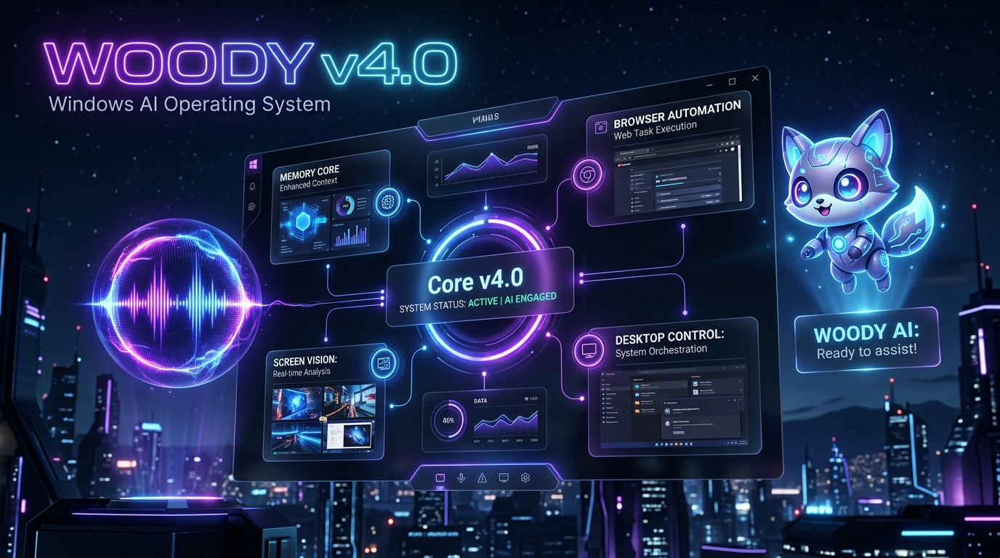
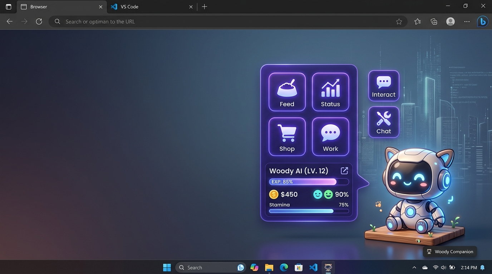
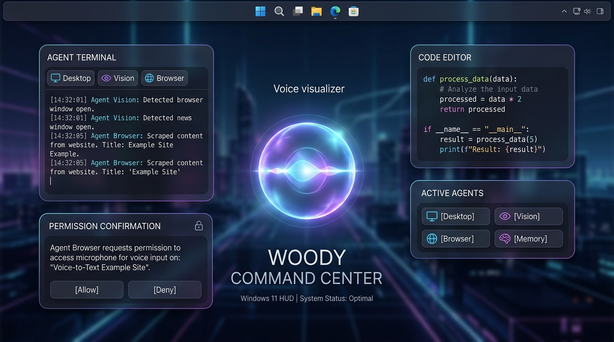

<div align="center">

# 🌟 Woody v4.0 — The Futuristic Windows AI Operating System Layer

<p align="center">
  
</p>

### *Perceive. Reason. Act. Remember. Stay invisible until summoned.*

**Woody v4.0** is an autonomous, local-first Windows AI Operating System layer designed to transform your desktop experience. Engineered with persistent multimodal memory, ultra-fast screen perception, sub-second neural voice streaming, multi-agent swarm intelligence, universal browser & site-targeted deep search, fluid liquid glass HUDs, and an authentic animated AI desktop companion powered by the **VPet Simulation Engine**.

<br/>

[](README.md)
[](https://python.org)
[](https://microsoft.com/windows)
[](https://aistudio.google.com/)
[](https://groq.com)
[](vpet/)
[](https://inworld.ai)
[](LICENSE)

</div>

---

## ⚡ What's New in Woody v4.0: Highlights at a Glance

<table>
  <tr>
    <td width="50%" valign="top">
      <h3>🧠 Persistent Memory Subsystem</h3>
      <ul>
        <li><b>Semantic Facts &amp; Profile:</b> Persistently remembers your name, preferences, project details, and key-value facts (<i>"remember that my name is Pushkar"</i>).</li>
        <li><b>Timestamped Notes &amp; Reminders:</b> Stores and retrieves timestamped notes (<i>"store this note: buy groceries tomorrow"</i>, <i>"what are my notes?"</i>).</li>
        <li><b>Searchable Episodic History:</b> Full-text keyword search across past session tasks, commands, and outputs (<i>"what did I ask earlier?"</i>).</li>
        <li><b>Sub-10ms Memory Recall:</b> Dedicated <code>MemoryAgent</code> for instant, zero-latency fact recall, note management, and prompt context injection.</li>
      </ul>
    </td>
    <td width="50%" valign="top">
      <h3>🌐 Universal Browser &amp; Site Search</h3>
      <ul>
        <li><b>30+ Web Platforms Built-In:</b> Direct deep-search integration for YouTube, Google, Reddit, GitHub, Spotify, Amazon, Wikipedia, Twitter/X, Netflix, ChatGPT, Claude, and more.</li>
        <li><b>Targeted Browser Execution:</b> Launch and search seamlessly across Microsoft Edge, Google Chrome, Brave, and Mozilla Firefox.</li>
        <li><b>Typo-Tolerant Natural Language:</b> Sub-10ms deterministic parsing for queries like <i>"open youtube on edge and serch there mrbeast"</i> or <i>"open edge and search iphone on youtube"</i>.</li>
        <li><b>Compound Multi-App Launcher:</b> Decomposes multi-app launches (e.g. <i>"open notepad, calculator, and edge"</i>) into ordered subtasks.</li>
      </ul>
    </td>
  </tr>
  <tr>
    <td width="50%" valign="top">
      <h3>⚡ Rapid Desktop Perception &amp; Vision</h3>
      <ul>
        <li><b>Sub-Second Screen Analysis:</b> Replaced slow full-screen CPU OCR bottlenecks with Win32 UI Automation tree context extraction (&lt;5ms).</li>
        <li><b>Zero-Lag Fallback Pipeline:</b> Downsampled visual grounding combined with high-speed Groq and Google Gemini synthesis.</li>
        <li><b>Window Disambiguation:</b> Real-time active window title, control hierarchy, and multi-monitor display inspection.</li>
        <li><b>False-Positive Launch Prevention:</b> Strict executable and registry verification prevents false-positive app status reports.</li>
      </ul>
    </td>
    <td width="50%" valign="top">
      <h3>🐾 Authentic VPet Desktop Companion (<code>--pet</code>)</h3>
      <ul>
        <li><b>6,180+ Animation Frames:</b> Native graph state machine executing 25+ official interactive animations (Idle, Meow, Tennis, Music, Sleep, Work, Pinch, Squat, Say, Level-Up).</li>
        <li><b>Full RPG Life Simulation:</b> Real-time Level, EXP, Money ($), Fullness, Thirst, Stamina, Mood, and Likability tracking.</li>
        <li><b>120+ Authentic LPS Catalog Items:</b> Complete LinePutScript items (foods, drinks, medicine, gifts) with full English localization.</li>
        <li><b>Work &amp; Study Jobs:</b> Earn money through AI Coding, Live Streaming, Calligraphy, and Analytics with floating Purple WorkTimers.</li>
        <li><b>Zero-Latency Neural Voice:</b> Sentence-pipelined Inworld TTS-2 streaming (&lt;50ms queue) with native audio feedback cues.</li>
      </ul>
    </td>
  </tr>
</table>

---

## 🐾 Meet Woody — Your AI Desktop Pet Companion

Woody is not just a hidden background daemon; it features an authentic, fully animated **AI Desktop Pet** that lives directly on your Windows desktop. Talk to Woody via voice, have it inspect your active applications, automate tedious workflows, feed it snacks, or let it work jobs to earn money!

<p align="center">
  
</p>

### 🎬 Animated Pet Sprite States

<div align="center">

| Walking Right | Idle & Observing | Going to Sleep | Sleeping | Waking Up |
|:---:|:---:|:---:|:---:|:---:|
|  |  |  |  |  |
| `walk_positive` | `idle` | `idle_to_sleep` | `sleep` | `sleep_to_idle` |

</div>

### ✨ VPet Simulation Features:
- **6,180+ Official Animation Frames:** Direct integration of the official LorisYounger/VPet core sprite graph across 25+ unique interactive animations.
- **5-Tab Floating Royal Purple Toolbar (`prupe.lps`):**
  - 🍲 **Feed:** Feed foods, drinks, snacks, and medicine to restore fullness and health.
  - 📊 **Status:** View Level, EXP, Health, Stamina, Mood, Hunger, Thirst, and Likability.
  - 🎭 **Interact:** Play tennis, blow bubbles, touch head/body, pinch cheeks, or make it dance.
  - 🏪 **Shop:** Purchase from 120+ translated catalog items using earned coins ($).
  - 💼 **Work:** Start real-time Work & Study jobs (AI Coding, Streaming, Math, Analytics) with floating purple countdown timers.
  - 💬 **Chat / Voice:** Direct chat input box and voice listening toggle.
- **Full Woody AI Brain & Tools:** Single-click the pet to trigger Woody's voice greeting and chat box — ask Woody to open applications, search YouTube or GitHub on Edge, analyze your screen, store notes in memory, or execute complex desktop tasks.
- **Zero-Latency Sentence TTS Pipeline:** Instant voice output (<50ms queue) with Inworld Neural Voice (`community-blcuaurhzmvi`) and native audio feedback (purrs, chimes, coin clinks).
- **Persistent State:** Saves character progress, level, inventory, and stats to `~/.woody/vpet_save.json`.

```bash
# Launch Woody in Desktop Pet mode
woody --pet
```

---

## 🔮 Liquid Obsidian Glass Command Center (`--web-ui`)

Woody features a state-of-the-art UI system crafted with **Apple-inspired fluid glassmorphism**, specular catch-lights, and responsive ambient backdrops.

<p align="center">
  
</p>

- **Dynamic Voice Visualizer Orb:** Glows and modulates in real-time as you speak or when Woody responds.
- **Live Markdown Stream:** Watch agent reasoning steps, code blocks, and formatted summaries appear incrementally.
- **Multi-Agent Switcher:** Monitor real-time statuses for **Desktop Agent**, **Vision Agent**, **Browser Agent**, **System Agent**, and **Memory Agent**.
- **Human-in-the-Loop Safety:** Destructive actions (e.g. deleting files, closing unsaved apps) generate inline confirmation cards requiring explicit authorization.
- **Global Hotkeys:**
  - `Ctrl + Alt + Space` / `Ctrl + Space` — Toggle Command Center HUD
  - `Ctrl + /` — Instant focus into prompt textarea
  - `Esc` — Collapse & hide to system tray

```bash
# Launch Woody with the full Glassmorphism WebEngine Overlay
woody --web-ui

# Launch with native PySide6 floating bar
woody
```

---

## 🏗️ Multi-Agent Swarm Architecture

```
                  ┌─────────────────────────────────────────┐
                  │   User Input (Voice / Hotkey / Web UI)  │
                  └────────────────────┬────────────────────┘
                                       │
                  ┌────────────────────▼────────────────────┐
                  │             Perception Bus              │
                  │   Wake Word → Silero VAD → Whisper STT  │
                  │   Event-Driven Win32 UI Tree & OCR Hook │
                  └────────────────────┬────────────────────┘
                                       │
                  ┌────────────────────▼────────────────────┐
                  │    LangGraph Router & Task Planner      │
                  │ (Fast Intent Classification & Decompose)│
                  │    [Groq / Google Gemini / Ollama]      │
                  └────────────────────┬────────────────────┘
                                       │
         ┌─────────────────────────────┼─────────────────────────────┐
         ▼                             ▼                             ▼
  ┌───────────────┐             ┌───────────────┐             ┌───────────────┐
  │ Desktop Agent │             │ Vision Agent  │             │ System Agent  │
  │ Win32/pywinauto             │ UI Tree + OCR │             │ psutil / WMI  │
  │ Click, Type,  │             │ Visual Reason │             │ Telemetry &   │
  │ Window Ops    │             │ UI Grounding  │             │ Process Mgt   │
  └───────┬───────┘             └───────┬───────┘             └───────┬───────┘
          │                             │                             │
          ├─────────────────────────────┼─────────────────────────────┤
          ▼                             ▼                             ▼
  ┌───────────────┐             ┌───────────────┐             ┌───────────────┐
  │ Browser Agent │             │  Memory Agent │             │  Coding Agent │
  │ Edge, Chrome, │             │ Facts, Notes, │             │ Python Code / │
  │ 30+ Platforms │             │ Episodic DB   │             │ REPL Sandbox  │
  └───────┬───────┘             └───────┬───────┘             └───────┬───────┘
          │                             │                             │
          └─────────────────────────────┼─────────────────────────────┘
                                       │
                  ┌────────────────────▼────────────────────┐
                  │         Critic / Verifier Loop          │
                  │ (Outcome Check & Self-Correction Engine)│
                  └────────────────────┬────────────────────┘
                                       │
                  ┌────────────────────▼────────────────────┐
                  │       Synthesizer & Audio Pipeline      │
                  │ (Inworld AI TTS-2 / Piper / Kokoro / Edge)│
                  └────────────────────┬────────────────────┘
                                       │
               ┌────────────────────────┴────────────────────────┐
               ▼                                                 ▼
      ┌───────────────────┐                             ┌───────────────────┐
      │  Desktop AI Pet   │                             │  Command Center   │
      │  (VPet + Audio)   │                             │ (Glassmorphic UI) │
      └───────────────────┘                             └───────────────────┘
```

---

## 🕹️ Launch Modes & CLI Reference

| Command | Description | Best For |
|---|---|---|
| `woody` | Full application with native PySide6 floating glass bar & tray | Daily desktop workflow |
| `woody --pet` | Interactive animated VPet desktop companion (6,180+ frames) | Cozy desk buddy & casual voice control |
| `woody --web-ui` | Apple-inspired fluid glassmorphic Command Center | Rich visual multi-agent experience |
| `woody --serve` | Headless FastAPI backend daemon (REST API + SSE) | Headless servers, background services |
| `woody --kernel-only` | Pure REPL terminal interface (no GUI) | Debugging, CLI scripting |
| `woody --eval` | Automated Phase evaluation & benchmark suite | Verification & quality testing |
| `woody --port 8765` | Custom backend port override | Multi-instance or non-standard port setups |
| `woody --config PATH` | Custom YAML configuration file path | Custom model / agent configurations |

---

## 🚀 Quick Start Guide

### 1. Prerequisites
- **Windows 10 / 11** (Required for Win32 API & UI Automation)
- **Python 3.12+** — [Download from python.org](https://python.org/downloads/)
- **Ollama** (for local offline LLMs) — [ollama.com](https://ollama.com)
- *(Cloud Providers)* **Google Gemini API Key** / **Groq API Key** / **Inworld AI Key** (for fast cloud reasoning, multimodal intelligence, and neural voice)

### 2. Installation

```powershell
# Clone the repository
git clone https://github.com/Pushkarmehra/Wodi.git
cd Wodi

# Run automated Windows setup script (installs venv & all dependencies)
.\scripts\install.ps1

# Or install manually with optional extras:
pip install -e ".[dev,audio,desktop,vision,ui,llm,cloud]"
```

### 3. Configure API Keys (Gemini, Groq, Inworld)

Copy `.env.example` to `.env` and set your API keys:

```ini
# ── Google Gemini Cloud (Multimodal AI & Reasoning) ──────────────────────────
# Get your Gemini API key from: https://aistudio.google.com/
GEMINI_API_KEY="your_gemini_api_key_here"
GEMINI_MODEL="gemini-1.5-flash"

# ── Groq Cloud (Ultra-Fast LLM Reasoning) ────────────────────────────────────
# Get your free key from: https://console.groq.com/keys
GROQ_API_KEY="your_groq_api_key_here"
GROQ_MODEL="llama-3.3-70b-versatile"

# ── Inworld AI Neural Voice (Recommended for Pet & Voice) ─────────────────────
# Get your key from: https://platform.inworld.ai/
INWORLD_API_KEY="your_inworld_api_key_here"
INWORLD_VOICE="Avery"
INWORLD_MODEL="inworld-tts-2"
INWORLD_DELIVERY_MODE="CREATIVE"

# ── OpenAI / Alternative Keys (Optional) ─────────────────────────────────────
OPENAI_API_KEY="your_openai_key_here"
TAVILY_API_KEY="your_tavily_key_here"
```

> [!NOTE]
> **Gemini API Key:** The `GEMINI_API_KEY` is fully supported for high-speed multimodal understanding, vision analysis, and reasoning tasks across Gemini 1.5 Flash, Gemini 1.5 Pro, and Gemini 2.0 models.

### 4. Pull Local Ollama Models (for Offline Mode)

```bash
# Recommended local models
ollama pull qwen2.5:7b
ollama pull nomic-embed-text
```

### 5. Launch Woody!

```bash
# Start your VPet Desktop Companion
python -m woody --pet

# Or open the modern Command Center
python -m woody --web-ui
```

---

## 🎤 Natural Language Usage Examples

| Domain | Voice / Text Prompt | Agent Executing |
|---|---|---|
| **Memory & Profile** | *"Remember that my name is Pushkar"* / *"Who am I?"* | Memory Agent (`remember_fact`, `recall`) |
| **Notes & Reminders** | *"Store this note: buy groceries tomorrow"* / *"What are my notes?"* | Memory Agent (`save_note`, `recall`) |
| **History & Context** | *"What did I ask earlier?"* / *"Search history for python"* | Memory Agent (`search_history`) |
| **Site & Browser Search** | *"Open YouTube on Edge and search there MrBeast"* | Browser Agent (`search_site` on Edge) |
| **Direct Site Search** | *"Search iPhone 16 on Amazon"* / *"Play Believer on Spotify"* | Browser Agent (Site Deep-Search) |
| **Compound Multi-App** | *"Open Notepad, Calculator, and Edge"* | Desktop Agent (Multi-App Decomposer) |
| **Desktop Automation** | *"Open Notepad, type my project notes, and save it to Desktop"* | Desktop Agent (Win32 Automation) |
| **Multimodal Vision** | *"Look at my screen and summarize this open document"* | Vision Agent (Fast UI Tree + Groq/Gemini) |
| **System Diagnostics** | *"What processes are taking up the most RAM right now?"* | System Agent (psutil / WMI) |
| **Pet & Life Sim** | *"Woody, start working on Python AI Coding"* / Feed food 🍲 / Pet head 💖 | VPet Engine & Graph State Machine |
| **Code Generation** | *"Write a Python script to convert all PNGs to WebP in this folder"* | Coding Agent (Sandbox REPL) |

---

## ⚙️ Configuration & Hardware Tiers

Woody automatically detects your system hardware on boot and configures the optimal tier. You can customize settings in [`config/woody_config.yaml`](config/woody_config.yaml):

```yaml
general:
  name: "Woody"
  tier: "auto"                 # auto | lite | standard | pro

perception:
  wake_word:
    enabled: true
    engine: "openwakeword"     # openwakeword | porcupine | disabled
    phrase: "hey woody"
  vad:
    enabled: true
    threshold: 0.55
  stt:
    model: "base"              # tiny | base | small | medium | large-v3

models:
  provider: "groq"             # groq | gemini | ollama | openai
  router: "openai/gpt-oss-20b"
  planner: "openai/gpt-oss-120b"
  vision: "dynamic"

agents:
  desktop:
    enabled: true
  vision:
    enabled: true
  browser:
    enabled: true
  system:
    enabled: true
  memory:
    enabled: true
```

| Tier | Minimum Specs | Models Used | STT Engine |
|---|---|---|---|
| **Lite** | Intel Core i5 / 8GB RAM (CPU only) | `qwen2.5:1.5b` / Groq Cloud / Gemini Flash | Whisper `tiny` / `base` |
| **Standard** | RTX 3060 / 16GB RAM / NPU | `qwen2.5:7b` + `nomic-embed` | Whisper `small` + Silero |
| **Pro** | RTX 4080+ / 32GB+ RAM | `qwen2.5:14b` + Qwen2.5-VL / Gemini Pro | Whisper `medium` / `large-v3` |

---

## 📂 Project Directory Structure

```
Wodi/
├── assets/                  # Banners, interface mockups, showcase imagery
│   ├── banner.jpg           # Hero banner (Woody v4.0)
│   ├── command_center.jpg   # Obsidian glass command center HUD
│   └── desktop_pet.jpg      # VPet desktop companion showcase
├── config/                  # Default configurations (woody_config.yaml)
├── gifs/                    # Sprite fallback animation loops
├── scripts/                 # Automated setup & utility scripts (install.ps1)
├── tests/                   # Comprehensive pytest test suite
├── vpet/                    # Authentic VPet-Simulator Core assets & LPS files
│   └── VPet-main/           # 6,180+ frames, animations, item LPS, English dicts
└── woody/                   # Core Python package
    ├── agents/              # LangGraph multi-agent swarm (Desktop, Vision, System, Browser, Memory, Chat)
    ├── critic/              # Verification & self-correction engine
    ├── ipc/                 # Inter-process communication & FastAPI SSE event bus
    ├── kernel/              # Core lifecycle, configuration & hardware tier detection
    ├── memory/              # Vector RAG, semantic preferences, facts, notes & episodic DB
    ├── observability/       # Logging, tracing & evaluation harness
    ├── perception/          # Audio capture, wake word, VAD & screen capture hooks
    ├── planner/             # Task decomposition & LangGraph router
    ├── synthesis/           # Neural TTS audio pipeline (Inworld AI, Piper, Kokoro, Edge)
    ├── tools/               # Win32 automation, memory tools, browser tools, MCP host & system tools
    └── ui/                  # Native PySide6, Liquid Glass WebEngine, & VPet Engine
        ├── desktop_pet.py   # Complete VPet Desktop Companion with Purple Theme
        ├── vpet_engine.py   # VPet life sim, RPG stats, jobs & LPS item parser
        ├── vpet_graph.py    # Frame-by-frame 25-action animation player
        └── web_overlay.py   # Liquid glass command center overlay
```

---

## 🔒 Security, Safety & Privacy

- **Local-First Privacy:** Sensitive data, screenshots, and audio can execute entirely on your local hardware.
- **Permission Tiers:** High-impact actions (file deletion, registry edits, system shutdown) require inline interactive user confirmation.
- **Prompt Injection Defense:** Screen OCR and clipboard inputs are treated as **untrusted data**, never direct instruction prompts.
- **Audit Logging:** Every planner step, tool execution, and agent response is logged to a local SQLite database for full transparency.

---

## 🗺️ Roadmap & Phase Milestones

| Phase | Description | Status |
|---|---|---|
| **Phase 0** | Wake word ("Hey Woody"), Silero VAD, Streaming STT, Audio Pipeline | ✅ Completed |
| **Phase 1** | LangGraph Planner, Desktop Agent, Win32 Automation, Critic Loop | ✅ Completed |
| **Phase 2** | Multimodal Vision Agent, Event-Driven Screen Hooks, OCR Grounding | ✅ Completed |
| **Phase 3** | Animated AI Desktop Pet Companion (`--pet`), Inworld Neural TTS-2 | ✅ Completed |
| **Phase 4** | Apple-Inspired Fluid Glassmorphism Command Center (`--web-ui`) | ✅ Completed |
| **Phase 5** | VPet Core Simulation Engine (6,180+ frames, 25 actions, 120+ items, jobs) | ✅ Completed |
| **Phase 6** | Universal Browser Agent (30+ Platforms, Edge/Chrome, Site Search) | ✅ Completed |
| **Phase 7** | Persistent Memory Subsystem (Facts, Notes, Searchable Episodic DB) | ✅ Completed |
| **Phase 8** | One-Click Signed Windows MSIX Installer & Auto-Updater | 🔲 Planned |

---

## 📄 License & Attribution

- Released under the **[MIT License](LICENSE)**.
- Built with ❤️ for Windows automation enthusiasts and AI agent builders.
- Special thanks to the open-source communities behind **[LorisYounger/VPet](https://github.com/LorisYounger/VPet)**, **LangGraph**, **Ollama**, **Google Gemini**, **Groq**, **PySide6**, **Silero VAD**, **Faster-Whisper**, and **Inworld AI**.
